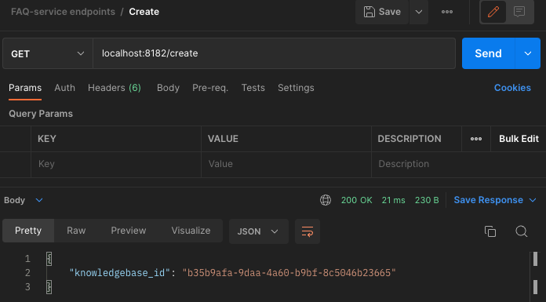
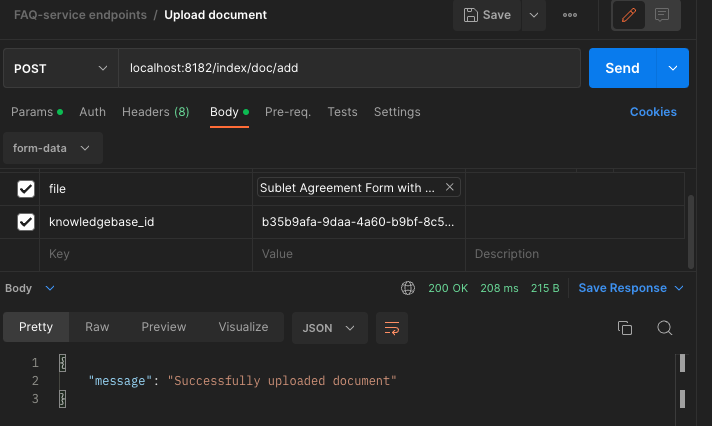
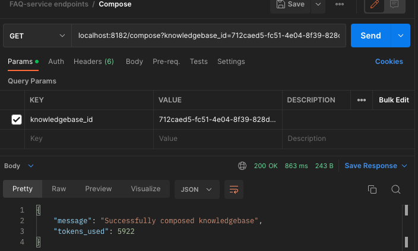
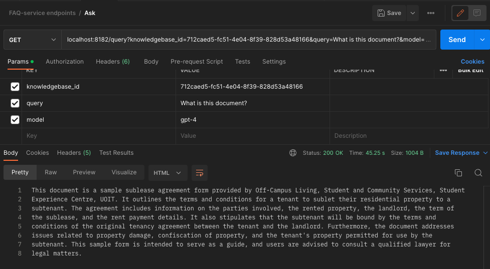

# FAQ-Service

### Overview
FAQ-Service is a service that creates a RESTful interface for creating, managing, and querying your own custom knowledgebases

### How does it work?
FAQ-Service is self-hosted. At its base, it is a flask application that acts as an API-server interface for our custom indexing and querying system. 
Upon installing FAQ-Service locally or on docker (see below), you can immediately start creating and querying knowledgebases

Knowledgebases consist of a collection of files. You first call a creation endpoint to create a knowledgebase, this will give you a knowledge ID. After a knowledgebase ID is retrieved, you can pack the knowledgebase with content, you can load the knowledgebase with content by using files or links, our indexing system (using llama-index under the hood) is automatically able to interpret most popular file types such as PDF, DOCX, TXT, CSV, etc. You can also load a knowledgebase from a link.

Adding documents to your knowledgebase builds a document store. When you are ready to query your knowledgebase, you can compose your knowledgebase. Compositions are what we call turning the document store into a vector index. Knowledgebase compositions have multiple different parameters that allow you to specify what type of index you want to be created, what LLM to use, and etc.

After composing your knowledgebase, you will be able to query your knowledgebase. A full-fledged example can be seen below:

Creating a knowledgebase:


Adding documents to a knowledgebase:


Composing the knowledgebase:


Querying the composed knowledgebase:


# Installation & Setup
FAQ-Service is a python flask service that you can install with python >=3.9. 

First install the base requirements:
```
python3.9 -m pip install -r requirements.txt
```

Install flask-async
```
python3.9 -m pip install "flask[async]"
```

You then need to create a file named `.env` in the root of the project and populate it with your openAI key and organization, it should look as follows:
```text
OPENAI_API_KEY="sk-....."
OPENAI_ORGANIZATIOn="org-..."
```

Then, in the root directory you can run the routes.py as the entrypoint
```
python3.9 routes.py
```